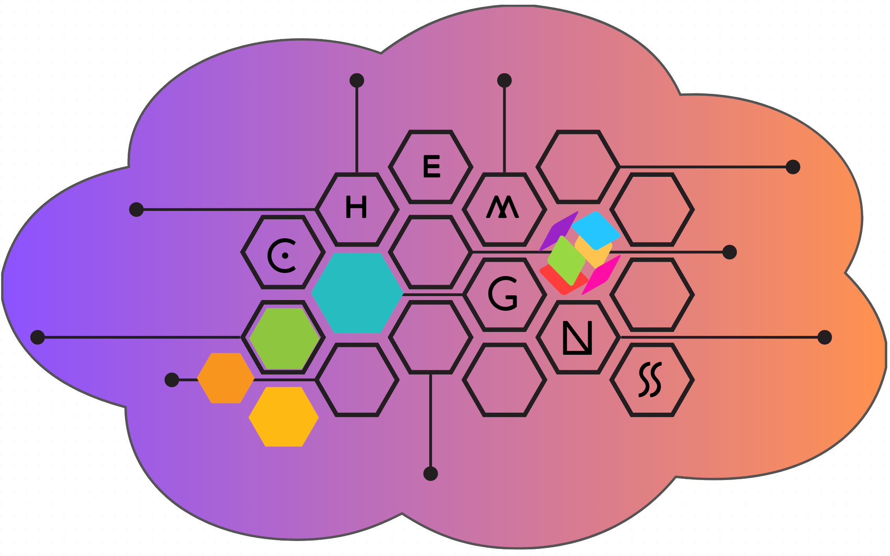
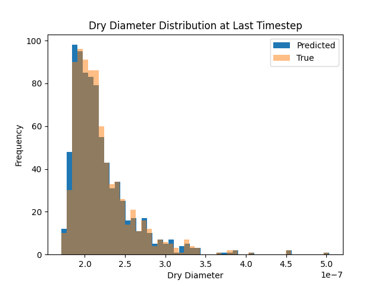

# ChemGNS: Train, Test, Predict



- Inspired by Pytorch GNS[^1]: https://www.geoelements.org/gns
- Multi-dimensional time-changing features 
- Multi-dimensional node properties 
- Alternative activation functions 
- Prediction pipeline 
- Data transformation pipeline 
- Output analysis pipeline

> [^1] Kumar, K. and Vantassel, J., 2022. GNS: A generalizable Graph Neural Network-based simulator for particulate and fluid modeling. arXiv preprint arXiv:2211.10228.

## Requirements

glob, pathlib, os, re, absl, pickle, matplotlib, numpy, random, json, collections, sys, time, tqdm, typing, torch, pyg

For Pytorch-geometric (pyg) find out your CUDA from python IDE:
   
```python
[In] print(f"PyTorch has version {torch.__version__} with cuda {torch.version.cuda}")
[Out] PyTorch has version 2.1.0+cu121 with cuda 12.1
```
In terminal:

```bash
# Install torch geometric
pip install torch-cluster -f https://data.pyg.org/whl/torch-2.1.0+cu121.html
pip install torch-scatter -f https://data.pyg.org/whl/torch-2.1.0+cu121.html
pip install torch-sparse -f https://data.pyg.org/whl/torch-2.1.0+cu121.html
pip install torch-geometric
```

## Make the necessary directories

- data, model, output within the gns folder
- raw_data, proc_data, shared_data within the chem_data folder


## run.py: prepare, train, test and postprocess script

For convenience you may use the run.py script to get some output data to analyze right away.
```bash
python run.py
```

In the script, change as approriate to your input data and experiment:
```python
#### Set these as appropriate:
# PartMC-MOSAIC Data Examples:
raw_data_path = "./chem_data/processed_output_some/"
rollout_dicts = "./chem_data/proc_data/"
npz_path = "./gns/data/"
model_path = "./gns/model/"
rollouts_path = "./gns/output/"
material_properties = ['aero_number', 'BC', 'OC']
particle_chem = ['H2O', 'SO4']
gases = ['H2SO4']
train_steps = 300
scenarios = [0, 1, 3, 8]
total_reps = 0 # repeat one scenario n times
```

However, you may wish to run each command at a time from the terminal. If so, read on.

## Prepare the raw dataset for training

Open your terminal and go to the directory where folders chem_data and gns were placed. Make sure you are in the environment containing the necessary packages. 
```bash
# Prepare the raw data - assumed to be in specific txt format
python -m chem_data.chemgns --action='prepare' 
       --raw_data_path='<raw-data-path>'  --preped_data_path='<output path for prepared data>' 
       --universe=<integer> --material_properties='material property list' 
       --gases='gas chemistry list' --particle_chem='particle chemistry list' 
       --share_path='<path for sharing files between processes>'
```

## Train the prepared dataset

```bash
# Train for the first time
python -m gns.train --data_path='<prepared data path>' --model_path='<model storage path>' 
       --output_path='<rollout storage path>' -ntraining_steps=<integer total steps>
       
# Train some more
python -m gns.train --data_path='<prepared data path>' --model_path='<model storage path>' 
       --output_path='<rollout storage path>' --model_file='model-<last timestep>.pt' 
       --train_state_file='train_state-<last timestep>.pt' -ntraining_steps=<integer total steps>
```

## Test your model on test data

```bash
# Create a rollout using the test dataset
python -m gns.train --mode='rollout' 
       --data_path='<prepared data path>' 
       --model_path='<model storage path>' 
       --output_path='<rollout storage path>' 
       --model_file='model-<last timestep>.pt' 
       --train_state_file='train_state-<last timestep>.pt'
```


## Process the rollout for analysis

The rollout dataset needs to be processed for analysis. This is were we bring the data back to a state that makes sense to scientists. 
```bash
# Prepare the raw data - assumed to be in specific txt format
python -m chem_data.chemgns --action='analyze' 
       --rollout_data_path='<rollout storage path>'   
       --material_properties='material property list' 
       --gases='gas chemistry list' --particle_chem='particle chemistry list' 
       --proc_data_path='<path for rollout dictionaries>' 
       --share_path='<path for sharing files between processes>'
```


## Predict

Have a folder with the initial values for each chemistry in txt format.
```bash
# Prepare the raw data for prediction
python -m chem_data.chemgns --action='predict' 
       --raw_data_path='<raw-data-path>'  --preped_data_path='<output path for prepared data>' 
       --universe=<integer> --material_properties='material property list' --gases='gas chemistry list' 
       --particle_chem='particle chemistry list' --share_path='<path for sharing files between processes>'
       
# Predict!
python -m gns.train --mode='predict' --data_path='<prepared data path>' --model_path='<model storage path>' 
       --output_path='<rollout storage path>' --model_file='model-<last timestep>.pt' 
       --train_state_file='train_state-<last timestep>.pt'
```


## Analyze your results
In a python script or notebook, load `chem_data.analyze_results`:
```python
import chem_data.analyze_results as ar
help(ar)

Help on module chem_data.analyze_results in chem_data:

NAME
    chem_data.analyze_results

FUNCTIONS
    gd_from_vol(vol)
    
    load_rollout_data(path)
        Load pickle rollout files output by GNS.
        Args:
        path: path to the pickle files (default gns/output/), where each file corresponds to a rollout.
        
        Returns:
        dictionary: keys are string names of the rollout files.
    
    mass_concentration(mass_of_particles, aero_number, chem='all')
    
    mean_std_diameter(mass_of_particles)
    
    nmae(truth, pred)
    
    volume(chem, mass)
```

Example:


N.B.: documentation is a work in progress. Take a look at the notebooks in this repo for examples.


## CUDA Troubleshooting

For better runtimes, you will need [CUDA](https://en.wikipedia.org/wiki/CUDA)

Sometimes, you may get this message:
```bash
RuntimeError: ... something something CUDA ...`
```

Or you get a warning:
```bash
UserWarning: CUDA initialization: ...
rank = None, cuda = False
Training step: 0/1000. Loss: 6.990038871765137.
Training step: 1/1000. Loss: 6.946468830108643.
# slower
```
    
Simply run the following:
```bash
sudo rmmod nvidia_uvm
sudo modprobe nvidia_uvm        
```
